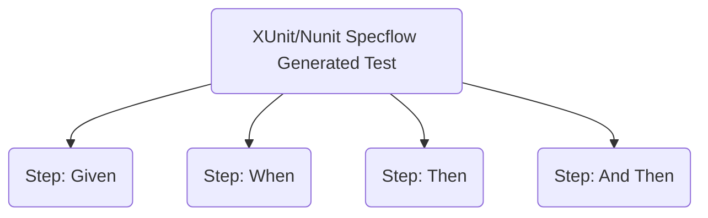
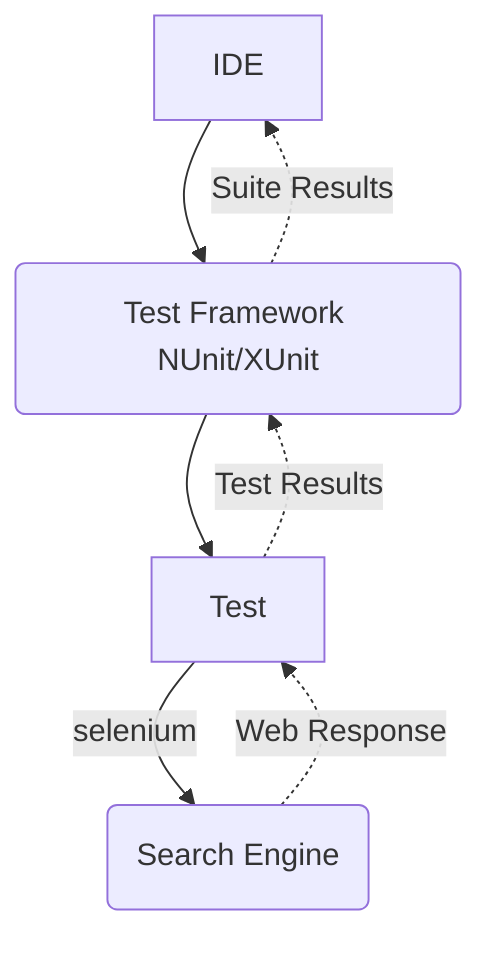
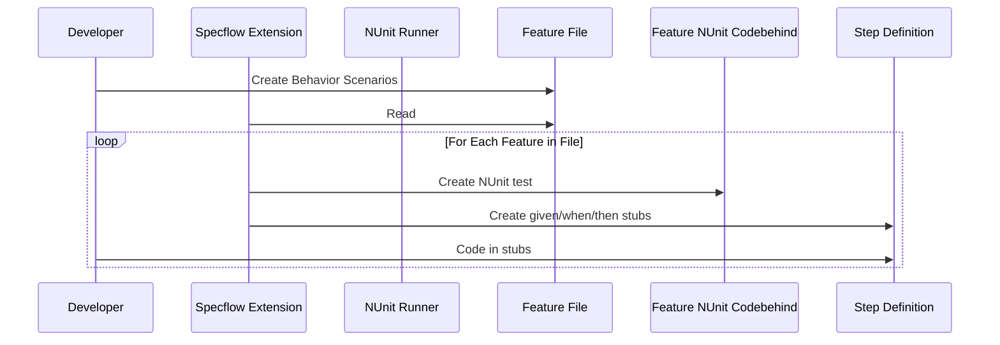
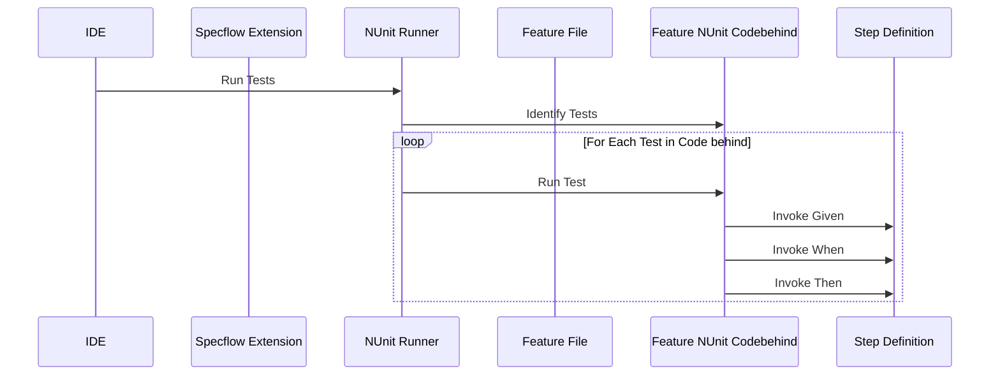

# BDD with SpecFlow and Selenium against public sites

Example C# used as a starting point for TDD / BDD class labs.

We write simple Selenium tests that operate against web sites as part of one of the labs. This project will eventually add standard non-BDD NUnit / Selenium integration tests. They will mimic the Behavior Driven Development (Specflow) based tests for the same scenario.

The repository was last developed in VS2022 community edition using C# and .Net 6. You should rebuild the solution to download dependencies and build the tests. Run the test with the standard VS Test Explorer.

## Gherkin Feature Definition
User Story and work item acceptance criteria that are written in Gherkin syntax can be copied into feature files.  Each line in the Gherkin is turned into a _step_ that is invoked by the unit tests.  The _SpecFlow Extension_ can be used to generate steps with the right syntax. Those steps are stored in step .cs files and are automaticaly called at test execution time.

This Scenario searches the Internet using the Google search engine and verifies that the domain associated with that search term is somewhere in the search results. The example feature is converted into 4 steps that use Selenium to execute their phases.

```gherkin
Scenario: Example - Search with Google
	Given I search the internet using site "google"
	When I use the term "microsoft"
	Then My search term should be in the title bar
	And There should be at least 1 links with the "microsoft.com" in them
```

The Scenario above executes in Specflow as 


This Scenario is virtually the same and uses the exact same test steps.  SpecFlow steps are parameterized so that this scenario can use the exact same steps as the previous one just passing different values for the parameters.

```gherkin
Scenario: Example - Search with Google
	Given I search the internet using site "bing"
	When I use the term "facebook"
	Then My search term should be in the title bar
	And There should be at least 1 links with the "facebook.com" in them
```

See the step .cs file for the details.

## Test Execution Path

This BDD web test executes using the same tools as any other test suite.  The test runner finds the NUnit defined tests in the test suite and runs them.  Individual tests use Selenium to call the remote web site and evaluate the model.




## Setup
I've only tested this with Visual Studio on Windows but it should work on other .Net supported platforms with VS Code.

1. Install the `SpecFlow Extension` for Visual Studio prior to loading this solution.  
1. Build the project to restore all the NuGet packages. 
1. Run the test in the `Test explorer`.

## Test Generation and Development
The Specflow IDE Extension creates and manages a `feature.cs` codebehind file for each `feature` file.  That codebehind file is an NUnit (or XUnit) suite that makes a call to step functions for each `Given` `When` and `Then` statement in the `.feature` feature file.  The developer is respnosible for putting the actual test code in the `step cs` file.



## Test Execution
The IDE teste jig, NUnit in this example, runs the tests that are in the `feature.cs` code behind files.  Those code generated tests call a helper method for each `Given` `When` and `Then` clause in the BDD definition for that test.  This means the test calls the coded helper methods in the step file which represent the test when sequened together. 


# References
* https://specflow.org/ C# BDD testing framework
* https://www.selenium.dev/ Web UI testing
* https://specflow.org/bdd/turn-specifications-into-automated-acceptance-tests/
