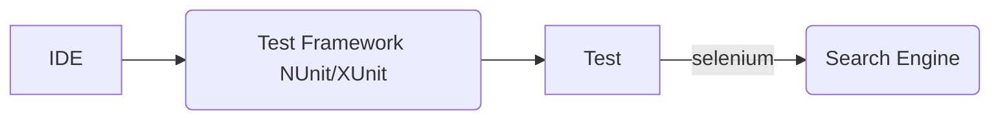
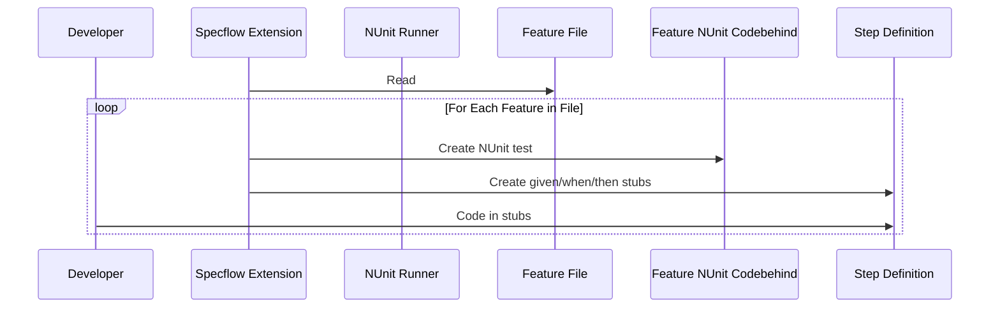
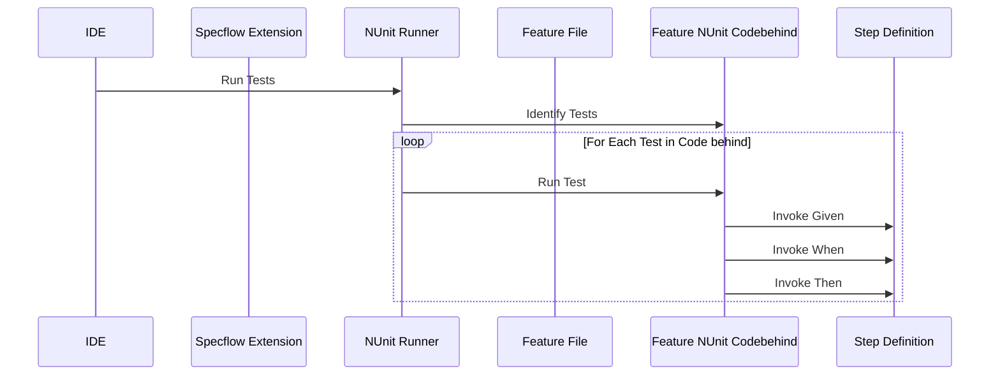

# TDD / BDD Selenium Sample

Example C# used as a starting point for TDD / BDD class labs. We write simple Selenium tests that operate against web sites as part of one of the labs.

This project will eventually add standard NUnit / Selenium integration tests written for the same scenarios as BDD (Specflow) based tests for the same scenario.

The solution was built in VS2022 community edition. Rebuld to download dependencies and build the tests

This BDD web test executes using the same tools as any other test suite that uses Selenium.

## Setup
Install the `SpecFlow Extension` for Visual Studio.  Build the project to restore all the NuGet packages. Run the test in the `Test explorer`.

## Test Generation and Development
The Specflow IDE Extension creates and manages a `feature.cs` codebehind file for each `feature` file.  That codebehind file is an NUnit (or XUnit) suite that makes a call to step functions for each `Given` `When` and `Then` statement in the `.feature` feature file.  The developer is respnosible for putting the actual test code in the `step cs` file.

## Test Execution
The IDE teste jig, NUnit in this example, runs the tests that are in the `feature.cs` code behind files.  Those code generated tests call a helper method for each `Given` `When` and `Then` clause in the BDD definition for that test.  This means the test calls the coded helper methods in the step file which represent the test when sequened together. 

# References
* https://specflow.org/ C# BDD testing framework
* https://www.selenium.dev/ Web UI testing
* https://specflow.org/bdd/turn-specifications-into-automated-acceptance-tests/
