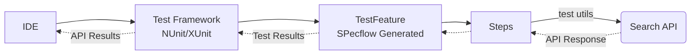
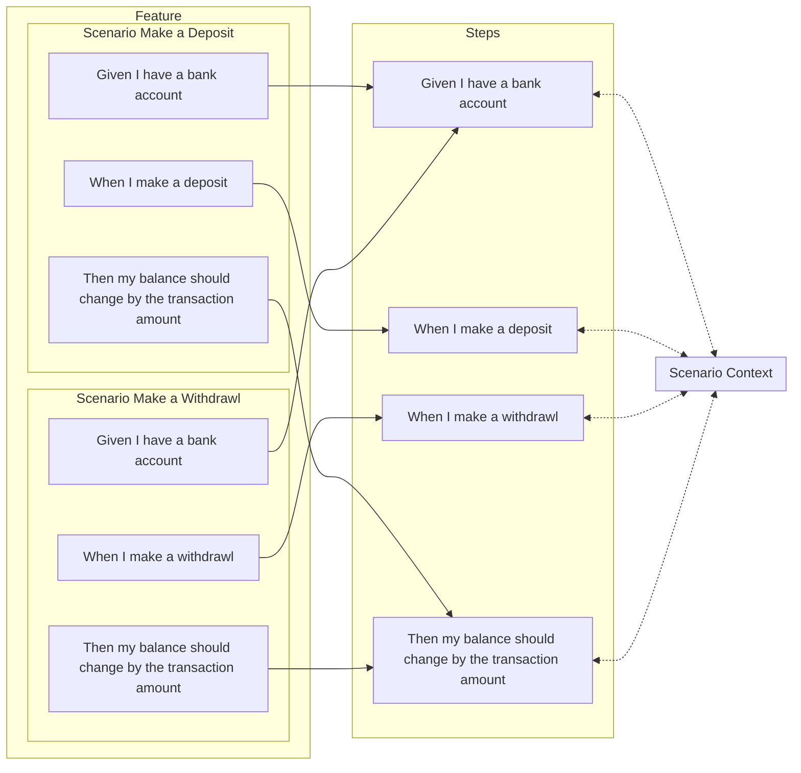
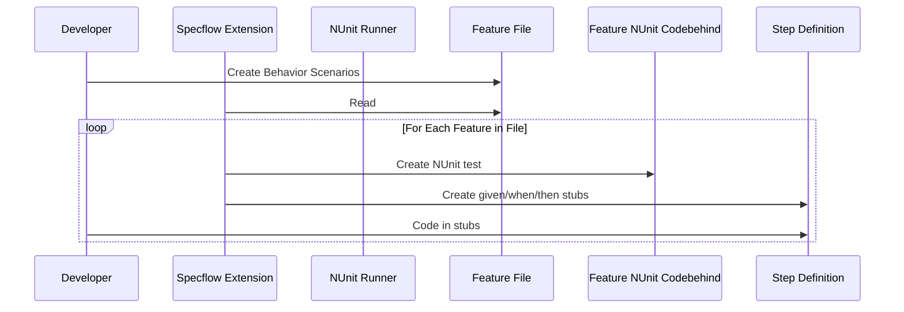
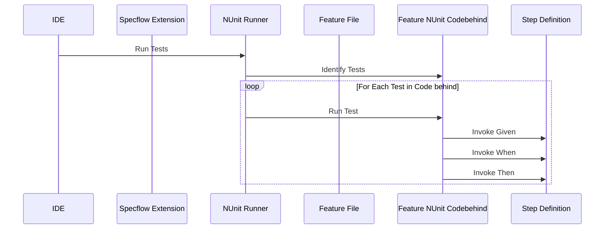

# BDD with SpecFlow and Selenium against public sites

Example C# used as a starting point for a TDD / BDD lab.

1. UI BDD tests using Selenium tests that operate against search web sites. 
1. Web API BDD tests that operate against search APIs.
1. An NUnit API test that operates against search APIs. This is used to shake out the API search engine adapter classes.

This project will eventually add standard non-BDD NUnit / Selenium integration tests.

The repository was last developed in VS2022 community edition using C# and .Net 6. You should rebuild the solution to download dependencies and build the tests. Run the test with the standard VS Test Explorer.

See the links at the bottom for more information on Behavior Driven Development, Gherkin and Specflow

## Gherkin Feature Definition
User Story and work item acceptance criteria that are written in Gherkin syntax can be copied into feature files.  Each line in the Gherkin is turned into a _step_ that is invoked by the unit tests.  The _SpecFlow Extension_ can be used to generate steps with the right syntax. Those steps are stored in step .cs files and are automaticaly called at test execution time.

This Scenario searches the Internet using the Google search engine and verifies that the domain associated with that search term is somewhere in the search results. The example feature is converted into 4 steps. Some of the steps invokeSelenium to make remote requests or interrogate the responses.

### Scenario in a feature
```gherkin
Scenario: Example - Search with Google
	Given I search the internet using site "google"
	When I use the term "microsoft"
	Then There should be at least 1 links with the trademark holder site "microsoft.com" in them
	And My search term should be in the title bar
```

### Another Scenario using the same steps
This Scenario is virtually the same and uses the exact same test steps.  SpecFlow steps are parameterized so that this scenario can use the exact same steps as the previous one just passing different values for the parameters.

```gherkin
Scenario: Example - Search with Bing
	Given I search the internet using site "bing"
	When I use the term "facebook"
	Then There should be at least 1 links with the trademark holder site "facebook.com" in them
	And My search term should be in the title bar
```

See the step .cs file for the details.

### Behavior should be isolated from implementation
This Scenario is more about the technical steps and less about behavior. This should be avoided in user stories and test definitions. The details can be hidden inside the steps.

```gherkin
Scenario: Example - Search with Google
    Given I want to search for something on the internet 
    When I open Chrome
        And I type "www.bing.com" into the url bar and hit enter
        And I click on the search box
        And I enter "facebook" into the search field
        And I click on the search button
    Then The browser HTTP code should be a 200
        And  The returned page should have at least 1 href "facebook.com" in them
        And "facebook" should be in the title bar of the results page
```

### Gherkin and SpecFlow and Automated Tests

The Scenario above can be automated using SpecFlow. The Specflow VS extension has BDD test project templates.  The extension automatically genereates `.cs` code behind file for each `.feature` file.  Devlopers can use the context menus to create step files or individual steps that can be pasted into step `.cs` files. The scenarios described above are broken down into a structure similar to.

```mermaid
graph TD
    subgraph FeaturePieces[A Feature]
    Feature(Specflow Feature containing multiple Scenarios)
    FeatureTests(Specflow generated Feature test class containing one Test for each Scenario)
        subgraph TD TestPieces[A Scenario]
            Test(A Specflow Generated XUnit/Nunit Test in a code generated Feature .cs)
            subgraph StepFile[Step File .cs]
                subgraph StepPieces[Developer Generated Steps]
                    GivenStep>Step: Given<br/>in .cs step file]
                    WhenStep>Step: When<br/>in .cs step file]
                    ThenStep>Step: Then<br/>in .cs step file]
                    Then2Step>Step: And Then<br/>in .cs step file]
                end
            end
            ScenarioContext[Scenario Scope<br/>ScenarioContext<br/>POCOs]
        end
    end
    Feature -.- FeatureTests -.- Test
    Test --- GivenStep
    Test --- WhenStep
    Test --- ThenStep
    Test --- Then2Step
 ```


## BDD Test Execution Path 

### Web Sites
BDD web test execute using Specflow as a driver for NUnit tests.  The test runner finds the NUnit defined tests in the test suite and runs them.  Individual steps use Selenium to call the remote web site and evaluate the model.

```mermaid
graph LR
    IDE --> TestFramework[Test Framework<br/>NUnit/XUnit] --> Test[Test Feature<br/>SpecFlow Generated] --> Steps -->|selenium| SearchWeb(Search Engine) --> SearchApi(Search API);
    SearchWeb -.->|Web Response| Steps ;
    Steps -.-> Test;
    Test -.->|Test Results| TestFramework;
    TestFramework -.->|Suite Results| IDE;

```

### APIs
BDD api test execute using Specflow as a driver for NUnit tests. The test runner finds the NUnit defined tests in the test suite and runs them. Individual steps use a web API library to make calls and extract resuts



## Specflow _steps_ can be reused
Features are composed of some mix of `Given`. `When`, `Then` steps.  The steps are implemented as standalone C# functions.  _Note that the Java based Cucumber works the same way._ 

Steps are essentially global to their assembly This means steps can be used in any of the Features in that assembly.  Steps need to be well written and modular with a a well understood set of inputs in order for them to be truely reusable for different purposes.

This graph shows two _Features_ sharing a couple of steps.


The `Given`, `When` and `Then` syntax in `Features` must be **exactly** the same in order for SpecFlow to recognize them as the same step function.    


## Setup
### Visual Studio
I've only tested this with Visual Studio on Windows but it should work on other .Net supported platforms with VS Code.

1. Install the `SpecFlow Extension` for Visual Studio prior to loading this solution.  
1. Build the project to restore all the NuGet packages. 
1. Run the test in the `Test explorer`.

### VS Code
See https://docs.specflow.org/projects/specflow/en/latest/vscode/vscode-specflow.html

### Setup for searching web search engines.
No configuration required

### Setup for searching APIs - when directly searching APIs
The `SimpleAPI..TestEnvironment` test projects run against search engine APIs instead of against the web pages.  To get this to work you have to register with Bing or Google to get search keys. (Bing only at the tieme of this writing)
1. Navigate to https://portal.azure.com/#view/HubsExtension/BrowseResource/resourceType/Microsoft.Bing%2Faccounts
1. Create a "Bing Search"
1. Find the search URL and keys generated

The API direct tests require a Bing API key in order to access the API.  Acquire that from the Azure portal and then put that value in a .runsettings file at the top of the solution. 

You can run the test project once you have completed the following steps.
1. Enable autodetection of a `.runsettings` file in Visual Studio `Tools->Options->Test->General` This will enable .runsettings for all test projects
1. Create .runsetting file in the root of this project
1. Put the following XML in that file putting your Bing subscription key in the correct place

```
<?xml version="1.0" encoding="utf-8"?>
<!-- File name extension must be .runsettings -->
<RunSettings>
  <RunConfiguration>
    <EnvironmentVariables>
      <!-- List of environment variables we want to set-->
      <BING_SEARCH_V7_SUBSCRIPTION_KEY>PUT_BING_SEARCH_KEY_FROM_AZURE_PORTAL_HERE</BING_SEARCH_V7_SUBSCRIPTION_KEY>
      <BING_SEARCH_V7_ENDPOINT>https://api.bing.microsoft.com/</BING_SEARCH_V7_ENDPOINT>
    </EnvironmentVariables>
  </RunConfiguration>
</RunSettings>
```


## Test Generation and Development
The Specflow IDE Extension creates and manages a `.feature.cs` codebehind file for each `.feature` file.  That codebehind file contains an NUnit (or XUnit) suite with one test for each scenario. Each codebehind test/scenario makes a call to step functions for each `Given` `When` and `Then` statement in the `.feature` feature file.  The developer is respnosible for putting the actual test code in the `step cs` file.



## Test Execution
The IDE teste jig, NUnit in this example, runs the tests that are in the `feature.cs` code behind files.  Those code generated tests call a helper method for each `Given` `When` and `Then` clause in the BDD definition for that test.  This means the test calls the coded helper methods in the step file which represent the test when sequened together. 


# References
* https://www.scaledagileframework.com/behavior-driven-development/ Scaled Agile and Behavior Driven Development

BDD with SpecFlow
* https://specflow.org/ C# BDD testing framework
* https://specflow.org/bdd/turn-specifications-into-automated-acceptance-tests/ 
* https://www.automatetheplanet.com/handling-parameters-specflow/ advanced SpecFlow parameter handling
* https://docs.specflow.org/projects/specflow/en/latest/Bindings/Sharing-Data-between-Bindings.html
* https://docs.specflow.org/projects/specflow/en/latest/Bindings/ScenarioContext.html
* https://docs.specflow.org/projects/specflow/en/latest/Bindings/Asynchronous-Bindings.html
* https://docs.specflow.org/projects/specflow/en/latest/Bindings/SpecFlow-Assist-Helpers.html

SpecFlow IDE Integration
* https://docs.specflow.org/projects/specflow/en/latest/visualstudio/Visual-Studio-Integration.html
* https://docs.specflow.org/projects/specflow/en/latest/Rider/rider-installation.html
* https://docs.specflow.org/projects/specflow/en/latest/vscode/vscode-specflow.html

Web Testing
* https://www.selenium.dev/ Web UI testing

Search Engine APIs
* https://docs.microsoft.com/en-us/bing/search-apis/bing-web-search/create-bing-search-service-resource
* https://docs.microsoft.com/en-us/bing/search-apis/bing-web-search/quickstarts/rest/csharp
* https://docs.microsoft.com/en-us/bing/search-apis/bing-web-search/search-responses

# Videos
[](http://www.youtube.com/watch?v=IFtegmYIq68 "Explore Behavior Driven Testing using public websites and .Net tools")
